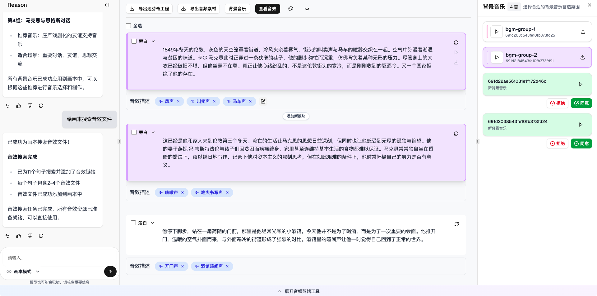
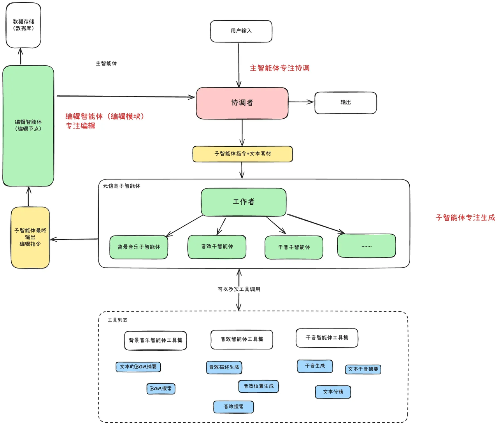
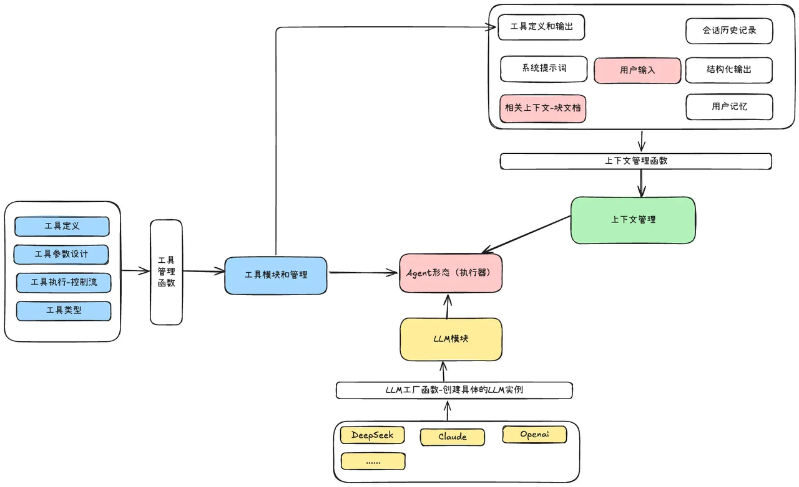
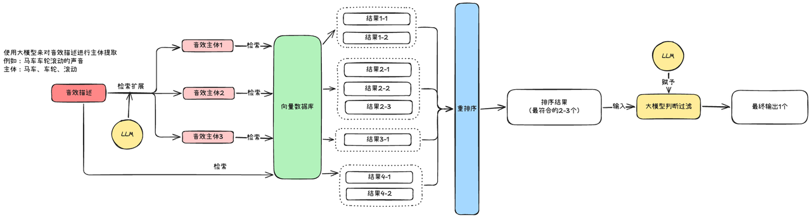
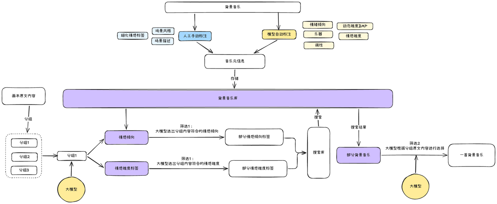
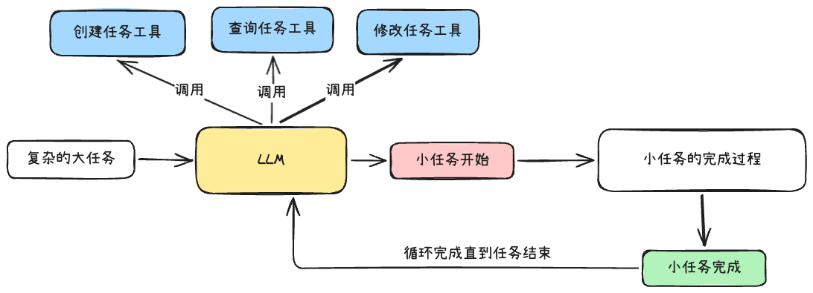
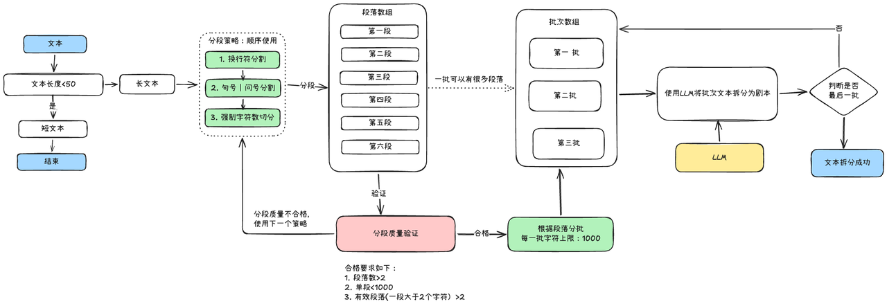
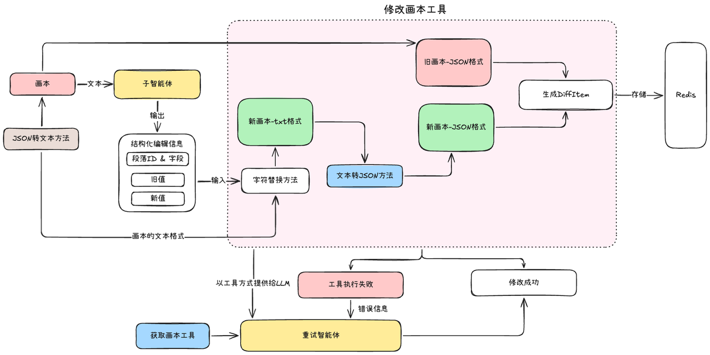
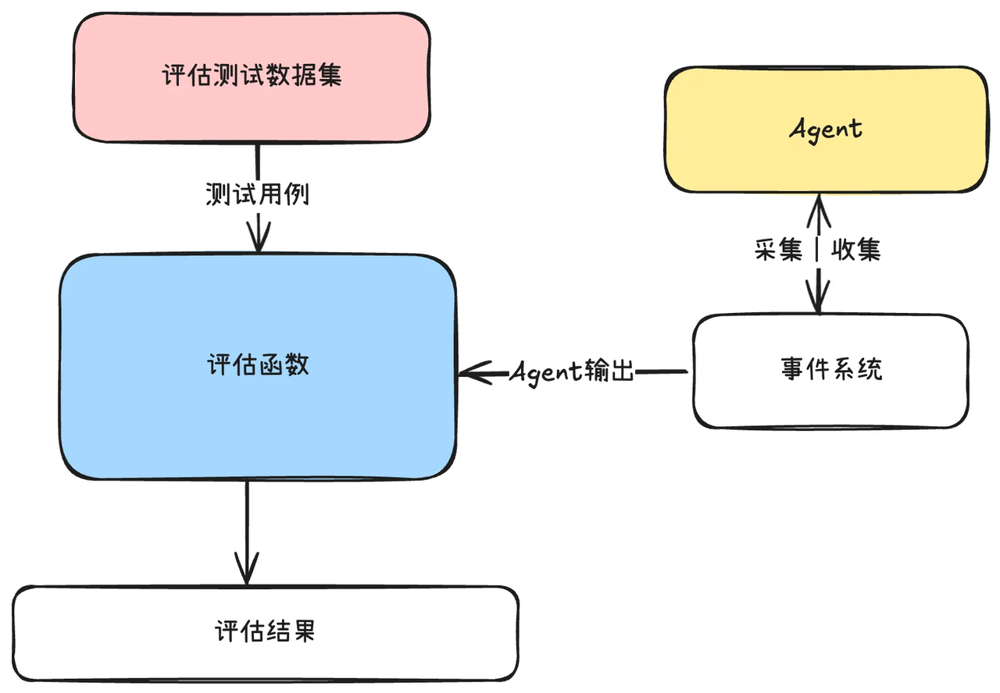

# Reason Voice Agent

> AI 驱动的音频创作协同平台 —— 让 AI 智能体帮你完成配音、音效、BGM 的智能匹配与生成

**在线演示**：https://xjk.github.io/reasonVoiceAgent-introduction/

## 一、音频制作Agent项目的介绍
**音频创作者和Agent在同一个平台上面完成音频的制作**，这个项目就是音频创作协同平台，里面的Agent就是音频制作Agent

  <figure>
    
    <figcaption>
      

      音频创作协同平台
      

    </figcaption>
  </figure>

## 一、后端Agent的总设计
采用一个主智能体和三个子智能体来构成整体Agent的核心
- 协调者(主智能体): 负责协调组织上下文，根据上下文来决定调用哪一个子智能体，如何调用
- 工作者(子智能体): 负责执行相关领域的任务，借助相应的工具来完成任务，这里会是多步工具的调用
- 编辑智能体：专注画本和前端显示的编辑

## 二、后端Agent的实现
上面的Agent总设计的实现，没有采用LangGraph框架来实现，而是采用了自己定义的概念设计实现

整个后端架构设计中，是按照上下文工程来做的设计，上下文管理是核心，它就是一个完整的大输入，以此输入作为前提，来解决用户的问题
1. LLM 模块：是使用 openaiSDK 来实现的多种型号模型的使用，这里是提供模型的
2. 工具模块和管理：工具是 LLM 关键的外部能力，是结合到上下文来让 LLM 使用的
3. 上下文管理：这个是统一的上下文，其负责编排好上下文，在 执行器中将上下文输入给 LLM，以 LLM 的输出来解决问题

## 三、核心工具的设计
### 3.1、音效检索工具

我们使用的音效检索的方案是：
1. 检索扩展：使用LLM等于音效描述进行多个主体的提取
2. 分别检索：使用多个音效主体和音效描述本身去向量数据库中检索
3. 重排序(Rerank)模型：对于全部的检索结果进行重新排序，并取出前2-3个
4. LLM筛选过滤：使用LLM对于重排序之后的结果再次进行筛选，以确保结果准确

### 3.2、背景音乐检索工具

我们在检索背景音乐使用的方案是：并行根据情感倾向和情感维度标签进行检索，一共两层筛选过滤流程
1. 第一层筛选：根据情感倾向和情感维度标签进行元信息检索，找出最合适该分组内容的元信息
2. 查询背景音乐库：根据筛选出来的部分元信息标签再去搜索背景音乐库，返回相应的部分背景音乐
3. 第二层筛选：根据部分背景音乐库，使用大模型来找到最合适哈分组原文内容的一首背景音乐

### 3.3、任务分批管理工具

复杂任务在这套工具的执行流程下是：
1. 当Agent发现用户输入的任务太复杂了，会主动调用创建任务的工具，然后将子任务分发给子智能体调用，
2. 当子智能体任务完成之后，将执行权交还给主智能体，
3. 主智能体会将子任务标注成功，继续分发下一个任务给子智能体，依次循环执行

### 3.4、文本拆分工具

执行流程是：
1. 先对文本进行分段，默认是顺序执行，先换行符分割，在句号、问号分割，最后强制字符数分割
2. 文本分段之后，要进行分段质量验证，验证不通过的话，使用下一个策略，重新对文本进行分段
3. 分段质量通过之后，会对于分段之后的文本进行分批操作，一批限制在1000个字符，一批就是一次输入给LLM

## 四、编辑模块的实现

在这种设计思路下，对于Agent来说，它需要修改画本的时候，本质上其实只需要旧值和新值，Agent的修改行为就可以成功，编辑工具的实现也很简单，只需要进行文本替换，这种设计非常的简单有效

## 五、Agent评估模块的实现

音频制作Agent的评估模块中，评估的点是调用过程，而不是结果：
1. 主智能体是否正确调用相应的子智能体
2. 子智能体是否正确调用相应的工具

只要评估出来这两层调用方式是正确的，那么最终的Agent结果就不会出现大问题，或者说出现问题的地方逐渐可以缩小为工具输出，而不是LLM的问题
- 这样保证了Agent运行的稳定性
- 一旦线上出现问题，可以快速聚焦到工具输出，排查路径很清晰，大幅降低了排查成本

## 技术栈

#### 前端
- 框架 / 构建：`React 19` `TypeScript` `Vite`
- 样式 / UI：`Tailwind CSS v4` `Radix UI` `Lucide` `Motion`
- 状态管理：`Zustand` `Immer`
- 音频 / 交互：`Howler.js` `Tone.js` `dnd-kit` `AntV G6`

#### 后端
- 运行时 / 框架：`Node.js 20` `TypeScript` `Koa`
- AI / Agent：`LangChain` `LangGraph` `OpenAI SDK` `Anthropic`
- 语音合成：`ElevenLabs` `Azure Speech SDK`
- 数据 / 存储：`Prisma` `ChromaDB` `Redis` `阿里云 OSS`
- 可观测性：`Langfuse` `OpenTelemetry` `FFmpeg`
- 音频处理：`FFmpeg`